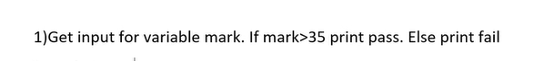
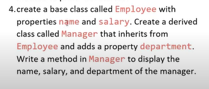

#  LEARN PYTHON FROM SCRATCH

## BASIC

 **TAKING INPUT** 
 * Eventhough the input are numbers, input() function only take it as String.
 * 'single quotes' and "Double quotes" are same in pyton
 * type() is used to specify what is datatype of the variable

```python
# Example

a = input('Enter a number : ')  # 10
b = input('Enter a number : ')  # 20
c = a + b
print(c)  # 1020 not 30

```

**TYPECASTING**
* converting existing datatype of a variable into desired datatype
* syntax :
    * desired_datatype(variable_name)

```python
# Resolving the problem
a = int(input('Enter a number : '))  # "10" -> 10
b = int(input('Enter a number : '))  # "20" -> 10
c = a + b
print(c)  # 30
```

**Example 1**


```python
name = input()  # "EMC"
age = input()   # "1"
print('My Name is :', name)    
print('My Age is :', age)
```


```python
name = input()  # "EMC"
age = input()   # "1"
address = input()   # Keeranur, Pudukkotai
print('My Name is :', name)
print('My Age is :', age)
print('My Address is :', address)
```


```python
a = int(input())   # "10" -> 10
b = int(input())   # "20" -> 20
c = int(input())   # "30" -> 30
multi = a*b*c
add = a+b+c
ans = multi/add
print('The Answer is :', ans)
```


```python
name = input('Enter your name : ')
score = int(input('Enter your score (out of 100) : '))
department = input('Enter your department : ')   
outOfTen = score/10
print('My Name is', name)
print('My Score is', outOfTen,'/10')
print('My Department is', department)
```

**if-elif-else condition**
* same as java but different syntax
> **syntax**
>   if(condtion):
>     statement
>   elif:
>     statement
>   else:
>     statement


```python
Meghna = input('Enter the status of Meghna (died or alive) :')
if(Meghna == 'died'):
  print('Surya weds Priya')
else :
  print('Surya weds Meghna')
```


```python
mark = int(input())
if(mark > 35):
  print('Pass')
else:
  print('fail')
```


```python
number = int(input('Enter the number'))

if number % 3 == 0 and number % 5 == 0:
  print('The number', number, 'is divisible by both 3 and 5')
else:
  print('The number', number, 'is not divisble by both 3 and 5')
```


```python
score = int(input('Enter your score (out of 100) : '))
if score <= 35:
  print('Poor Student')
elif 35 < score < 70:
  print('Average Student')
else:
  print('Good Student')
```


```python
a = int(input('A : '))
b = int(input('B : '))
operation = input('Operation : ')

if operation == 'add':
  print('Addition of A and B is', a+b)
elif operation == 'sub':
  print('Subtraction of A and B is', a-b)
elif operation == 'multi':
  print('Multiplication of A and B is', a*b)
elif operation == 'div':
  print('Division of A and B is', a/b)
else :
  print('Invalid Operation')
```

```python
score = int(input('Enter the score : '))

if score >= 70:
  name = input('Enter the name : ')
  department = input('Enter the department : ')
  location = input('Enter the location : ')
  print('Eligible')
else :
  print('Not Eligible')
```


```python
salary = int(input('Enter your Salary : '))
age = int(input('Enter your age : '))

if salary >= 20000 or age <= 25:
    loanAmount = int(input('Enter your loan amount : '))
    if loanAmount <= 50000:
      print('You are eligible for loan')
    else:
      print('Maximum loan amount is 50,000')
else:
    print('You are not eligible for loan')
```


```python
tamil = int(input('Enter Tamil score : '))
english = int(input('Enter English score : '))
math = int(input('Enter Math score : '))
science = int(input('Enter Science score : '))
social = int(input('Enter Social score : '))

sum = tamil + english + math + social + science
avg = sum/5

if avg < 35:
  print('Additional class is required')
else:
  print('Thalai neemirthu nadanga Parthiban')
```

**for loop**

* it has more functionality than the for loop in java

```python
for i in 'apple':
  print(i)
```
In the above code, "i" iterate through the word 'apple'. In each iteration 'i' takes single character in that word.

**range()**
* range(n) is a function used to list the numbers between 0 till n-1.
* Syntax :
  * range(start, stop, step)
* Rules :
  * start - (Optional) An integer number specifying at which position to start. Default is 0
  * stop  - (Required) An integer number specifying at which position to stop (not included).
  * step  - (Optional) An integer number specifying the incrementation. Default is 1 

```python
for i in range(5):
  print(i)
```
output
  


```python

for j in range(1,11):
  for i in range(1,11):
    print(i, 'x', j ,'=', i*j)
```


```python
a = int(input('Enter the starting number : '))
b = int(input('Enter the ending number : '))

for i in range(a,b):
  print(i)

```


```python
n = int(input('Enter the number : '))
count = 0
for i in range(1,n+1):
  if i % 2 == 0 :
    count += 1
print(count)
```


```python
count = 0
for i in range(1,100):
  if(i % 15 == 0):
    count += 1
print(count)
```


```python
sum = 0
for i in range(1,11):
    n = int(input(f'Enter the number {i}: '))
    sum += n
print('sum is',sum)
print('avg is', sum/10)
```


```python
n = int(input('Enter the number : '))
for i in range(1,n+1):
  print(f'Number is : {i} and cube of the {i} is : {i*i*i}')
```

**end in print()**

* it is used to print the content in single line.
* you can also use it specify in which delimiters they should be show separate. 

print this output


```python
n = int(input('Enter the number : '))
for i in range(1,n+1):
  for j in range(1,i+1):
    print(j, end=' ')   # in this each charater is separated by " "
  print()
```


```python

n = int(input('Enter the number : '))

for i in range(n+1):
  for j in range(i):
    print('*', end=' ') 
  print() 
```

## Python Collections

There are four types of collections :
* list
* Tuple
* Set
* Dictionary 

**List** 

* List items are ordered, changeable, and allow duplicate values.
* List items are **0 order indexed**.
* List items can be of any data type :
  >* list1 = ["apple", "banana", "cherry"]
  >* list2 = [1, 5, 7, 9, 3]
  >* list3 = [True, False, False]
* A list can contain different data types
  >* list1 = ["abc", 34, True, 40, "male"]
* most common function : insert(), append(), extend(), pop()
* Negative indexing -> end to start. **a[-1]** refers to the **last item**, **a[-2]** refers to the **second last item** etc.

Range of Indexes

* Indexing should be from left to right
```python
print(a[2:5])     # -> index from 2 till 4 (5-1)
print(a[:4])      # -> index from 0 till 3 (4-1)
print(a[2:])      # -> index from 2 till len(a)-1
print(a[-4:-1])   # -> index from -4 till -1
```

*  Check if Item Exists
```python
thislist = ["apple", "banana", "cherry"]
if "apple" in thislist:
  print("Yes, 'apple' is in the fruits list")
```
Append element in list

```python
a = []
a.append(1)
print(a)   # [1]
a.append(2)
print(a)    # [1, 2]
a.append(True)
print(a)    # [1, 2, True]
a.append('emc')
print(a)    # [1, 2, True, 'emc']
```
print length of list

```python
print(len(a))   # 4
```
add value at specific index
```python
a.insert(1,80)  # [1, 80, 2, True, 'emc']
```
modify value at specific index

```python
a[2] = 35   # [1, 80, 35, True, 'emc']
```
access element at specific index

```python
print(a[3]) # True
```

remove element as per index (0 based indexing) -> 0 till len(a)-1
```python
a.pop(1)    # [1, 35, True, 'emc']
```
remove element at the end

```python
a.pop() # [1, 35, True]
```
merge two list

```python
b = [1,'bcs', False]
a.extend(b)     # [1, 35, True, 1, 'bcs', False]
```

remove element by their value
```python
a.remove(35)    # [1, True, 1, 'bcs', False] 
```


**Tuple ()**
* Tuple items are ordered, **unchangeable**, and allow duplicate values. 
* Tuple items are 0 based indexed.
* Differnce between list and tuple
  * Tuples are unchangeable, meaning that we cannot change, add or remove items after the tuple has been created whereas we can do this in list.
* tuple with one element is not considered as tuple whereas it is considered as str. if you want to create tuple with one element then you can add a comma after the element to make it tuple.
```python
thistuple = ("apple", "banana", "cherry")
y = ("orange",)
thistuple += y

print(thistuple)
```
* for more knowledge visit [this](https://www.w3schools.com/python/python_tuples.asp) website


**Set {}**
* Set items are unordered, unchangeable, and do not allow duplicate values (same as HashSet in java).
* True/False and 1/0 are same in set but you can use '1'/'0'.
* Once a set is created, you cannot change its items, but you can add new items.
* update() is used instead of extend() as the order of the set is not define.
```python
thisset = {"apple", "banana", "cherry"}
mylist = ["kiwi", "orange", "apple"]

thisset.update(mylist)

print(thisset)  # {'apple', 'cherry', 'kiwi', 'banana', 'orange'}
```
* We can use **Vendiagram** function in this collection.
  * The **union()** (or) '|' and **update()** methods joins all items from both sets. 
  * The **intersection()** (or) '&' method keeps ONLY the duplicates. 
    * The difference between **intersection()** and **intersection_update()** is that **intersection_update()** will change the original set instead of returning a new set.
  * The **difference()** (or) '-' method keeps the items from the first set that are not in the other set(s). 
  * The **symmetric_difference()** (or) '^' method keeps all items EXCEPT the duplicates.


* [website](https://www.w3schools.com/python/python_sets.asp)

**Dictionary {}**
* Dictionary items are ordered, changeable, and do not allow duplicates. 
* Dictionary items are presented in key:value pairs, and can be referred to by using the key name (same as HashMap in java).
* Print the keys
```python
for x in thisdict:
  print(x)
# (or)
for x in thisdict.keys():
  print(x)
```
* Print the values
```python
for x in thisdict:
  print(thisdict[x])
# (or)
for x in thisdict.keys():
  print(x)
```
* Print the both keys and values
```python
for x, y in thisdict.items():
  print(x, y)
```
* [website](https://www.w3schools.com/python/python_dictionaries.asp)

## Functions
* Function call should come after defining the function.
* **Syntax**
```python
# def func(parameter):
#   statements
#   
# func() ## function call

```


```python
def add(x,y):
  return x+y

def sub(x,y):
  return x-y

def multi(x,y):
  return x*y

def div(x,y):
  return x/y


a = int(input('Enter the value for x : '))
b = int(input('Enter the value for y : '))
 
print('x + y =', add(a,b))
print('x - y =', sub(a,b))
print('x * y =', multi(a,b))
print('x / y =', div(a,b))
```


```python
n = int(input('Enter the number : '))

def findEvenOrOdd(x):
  if x % 2 == 0:
    print(x, 'is a even number')
  else:
    print(x, 'is a odd number')

findEvenOrOdd(n)
```


```python
def findPassOrFail(x):
  if x >= 35:
    print('PASS')
  else:
    print('FAIL')
      
n = int(input('Enter the number : '))
findPassOrFail(n)
```


```python
def printRange(a,b):
  for i in range(a, b+1):
    print(i)

x,y = int(input('Enter the Starting number : ')), int(input('Enter the ending number : '))

printRange(x,y)
```

```python
def validate(x,y):
  s_userName = 'EMC'
  s_password = '123'

  if x == s_userName and y == s_password:
    return 'Both username and password are valid'
  elif x != s_userName and y == s_password:
    return 'Invalid username'
  elif x != s_userName and y == s_password:
    return 'Invalid password'
  else:
    return 'Both username and password are invalid'


a = input('Enter your username : ')
b = input('Enter your password : ')

print(validate(a,b))
```

```python
def add(x, y):
    return x + y


def mulit(x, y):
    return x * y


a = int(input('Enter the value of a : '))
b = int(input('Enter the value of b : '))
c = int(input('Enter the value of c : '))

print(mulit(add(a, b), c))
```

**Lambda**
* A lambda function is a small anonymous function. 
* A lambda function can take any number of arguments, but can only have one expression.
* Syntax :
  * lambda arguments : expression
```python
x = lambda a : a + 10
print(x(5))

multi = lambda x,y : x*y
print(multi(5,6))
```

* Usage : use them as an anonymous function inside another function.
```python
def multi(n):
  return lambda a : a*n

myTriple = multi(3)

print(myTriple(11))
```

**Class and Objects**

* same concept like in java but different syntax.
* Create empty class
````python
class Laptop:
  pass
````
 

```python
class Laptop:
    price = 0
    processor = ""
    ram = 0


HP = Laptop()
HP.price = 10000
HP.processor = "intel i5"
HP.ram = 16
DELL = Laptop()
DELL.price = 12345
DELL.processor = 'intel i3'
DELL.ram = 8
LENOVO = Laptop()

print(HP.price, DELL.price, LENOVO.price)
```
**constructor**
* In the parameter of constructor and methods we have implicitly write **self** inside it (it will act like **this** in java).
* As per the python knowledge, the **self** carries the object name (object reference) inside the method which has self in it.
* `def __init__(self)` act as constructor in python.
* `def __str__(self)` used to print some string instead of printing the address of the object while trying to print the object.
without __str__()
```python
class Student:

    def __init__(self, name, std):
        self.name = name
        self.std = std


ajai = Student('ajai', 4)

print(ajai)     # <__main__.Student object at 0x000001B134094950>

```
with __str__()
```python
class Student:

    def __init__(self, name, std):
        self.name = name
        self.std = std

    def __str__(self):
        return f'Student name : {self.name} \nStudent std : {self.std}'


ajai = Student('ajai', 4)

print(ajai)     

'''
output 
Student name : ajai 
Student std : 4
'''

```

**Excersice**


```python
class Student:
    def __init__(self):
        self.name = ""
        self.registerNumber = 0

    def display(self):
        print('Student Name :', self.name)
        print('Student Register Number :', self.registerNumber)


ajai = Student()
sharan = Student()
ajai.name = "Ajai"
ajai.registerNumber = 420

ajai.display()
sharan.display()
```

```python
class Fruit:
    def __init__(self, color):
        self.color = color
    def display(self):
        print('The color is', self.color)


apple = Fruit('Red')
apple.display()
```

```python
class Teacher:
    def __init__(self, name, regNo):
        self.name = name
        self.regNo = regNo

    def display(self):
        print('Teacher name', self.name)
        print('Teacher register Number', self.regNo)


t1 = Teacher('Velmurugan', 12345)
t2 = Teacher('Ajai', 54321)

t1.display()
t2.display()
```

```python
class Calculator:
    def __init__(self, a, b):
        self.a = a
        self.b = b

    def add(self):
        return self.a + self.b

    def sub(self):
        return self.a - self.b

    def multi(self):
        return self.a * self.b

    def div(self):
        return self.a / self.b

    def display(self):
        print('a + b =', self.add())
        print('a - b =', self.sub())
        print('a * b =', self.multi())
        print('a / b =', self.div())


sample = Calculator(1, 5)

sample.display()
```

**Instantaneous Variable VS Class Variable**
* >  variable declared outside the constructor is known as Class Variable.
* >  declare a variable as class variable when it is going to be common for all the objects.
* >  declare a variable as instantaneous variable when it is going to be different for different objects.
```python
class Laptop:
    # class variable
    chargerType = "C-Type"

    def __init__(self, name, processor, ram):
        # instantaneous variable
        self.name = name
        self.processor = processor
        self.ram = ram

    def display(self):
        print('Laptop name :', self.name)
        print('Laptop processor :', self.processor)
        print('Laptop ram :', self.ram)
        # we can access the class variable using object reference as well
        print('Laptop charger type :', self.chargerType)


hp = Laptop('hp', 'intel i5', '16GB')
dell = Laptop('dell', 'intel i3', '8GB')
lenovo = Laptop('lenovo', 'intel i7', '32GB')

print('before changing the value in class variable')
hp.display()
dell.display()
lenovo.display()

Laptop.chargerType = "B-Type"

print('after changing the value in class variable')
hp.display()
dell.display()
lenovo.display()

```
* > Creating methods for class variable
```python
class Laptop:

    chargerType = 'C Type'

    def __init__(self):
        self.brand = ""
        self.price = 0

    def setPrice(self, price):
        self.price = price

    def getPrice(self):
        print(self.price)

    def changeCargerType(cls, chargerType):
        cls.chargerType = chargerType
        print(chargerType)


hp = Laptop()
# accessing instantaneous variable
hp.setPrice(720)
hp.getPrice()


# accessing class variable
Laptop.changeCargerType(Laptop, 'B-Type')

```
* > Using decorators (@classmethod, @staticMethod)
```python
class Laptop:

    chargerType = 'C Type'

    def __init__(self):
        self.brand = ""
        self.price = 0

# instantaneous method -> accessing both class and instantaneous variable.
    def setPrice(self, price):
        self.price = price
    def getPrice(self):
        print(self.price)

# class method  ->  accessing only class variable.
    @classmethod
    def changeCargerType(cls, chargerType):
        cls.chargerType = chargerType
        print(chargerType)

# static method -> we can not access neither class variable nor instantaneous variable

    @staticmethod
    def info():
        print("Buy pc not laptop")


hp = Laptop()
# accessing instantaneous method
hp.setPrice(720)
hp.getPrice()


# accessing class method
Laptop.changeCargerType('B-Type')

# accessing static method

Laptop.info()
# (or)
hp.info()
```
* >  Same concept as in java

**Inheritance**
* Inheritance allows us to define a class that inherits all the methods and properties from another class. 
* Parent class is the class being inherited from, also called base class. 
* Child class is the class that inherits from another class, also called derived class.


```python
class Shape:
    def area(self):
        return 0


class Rectangle(Shape):
    def area(self, length, width):
        return length * width


obj = Rectangle()
print(obj.area(10, 15))
```

```python
class Person:
    def __init__(self, name):
        self.name = name


class Student(Person):
    def __init__(self, name, grade):
        super().__init__(name)
        self.grade = grade

    def display(self):
        print('Student name :', self.name)
        print('Student grade :', self.grade)


obj = Student('ajai', "A")
obj.display()
```

```python
class Vehicle:

    def start(self):
        print('Vehicle started')


class Car(Vehicle):

    def start(self):
        print('Car started')


obj = Car()
obj.start()
```

```python
class Employee:
    def __init__(self, name, salary):
        self.name = name
        self.salary = salary

class Manager(Employee):
    def __init__(self, name, salary, department):
        super().__init__(name, salary)
        self.department = department

    def display(self):
        print('Manager Name :', self.name)
        print('Manager salary :', self.salary)
        print('Manager department :', self.department)


obj = Manager('Ajai', '12345', 'Computer')
obj.display()
```


